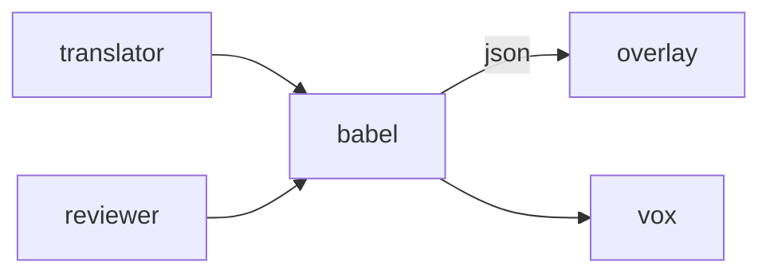

# Babel

**Translate the words. Keep the pet's character.**

A planned localization workspace for dialogue and UI, with translator suggestions, reviewer approval, and locale exports.

**Stage: design scaffold.** This checkout contains a design document and a source placeholder. The experience below is planned; there is no runnable app or integrated service yet.

[Status](#status) · [Planned experience](#planned-experience) · [Contributor quickstart](#contributor-quickstart) · [Service contract](docs/CONTRACT.md) · [Ecosystem map](https://github.com/RicheyWorks/computerpets-ecosystem)

## Status

| Available today | What you can inspect |
| --- | --- |
| [Service contract](docs/CONTRACT.md) | Intended behavior, boundaries, and planned dependencies. |
| [Source placeholder](src/babel/index.ts) | Name metadata only; no package.json, app, or runtime is checked in. |
| [MIT license](LICENSE) | Licensing terms for the repository. |

Gameplay, endpoints, integration arrows, and failure handling on this page describe implementation targets. No build/test harness, CI workflow, or product screenshots are included in this scaffold.

## Planned experience

- GET /v1/kits/{locale} — pending strings
- POST /v1/suggest — translator proposal
- POST /v1/approve — reviewer
- GET /v1/export/{locale} — json for clients

### Planned technology

TypeScript · React 19 · crowdin-style workflow · ICU messages · species-aware tone guides

### Planned connections

These arrows show intended dependencies, rather than working integrations.



## Contributor quickstart

With access to this private repository, Git and PowerShell are enough to review the scaffold:

```powershell
git clone https://github.com/RicheyWorks/computerpets-babel.git
Set-Location computerpets-babel
Get-Content docs/CONTRACT.md
Get-Content src/babel/index.ts
```

Read [Service contract](docs/CONTRACT.md) before choosing implementation details. The commands above inspect the checked-in files; app installation, editor launch, and server startup become possible after a buildable project and entry point are added.

### First implementation target

**en→es kit for overlay care verbs with suggest/approve/export.**

You know it works when: Missing locale: English fallback. Machine-only strings flagged. Short tone stays short.

Treat this as an acceptance target for a future implementation. Start with the documented slice, add the required project setup and focused tests, and update these instructions with commands that work from a fresh clone.

## Design boundaries

- Stay canon with 210 species. No illegal hybrids. No swapped voices.
- Treat the desktop overlay as the main quest. This organ is optional until wired.
- Fail soft: the overlay keeps walking if this service is down, unless this *is* the overlay.
- No PII in public artifacts (Steam id, wallet, home path, webcam frames).

**Required failure behavior:**

Machine-only translation → flagged, not shipped. Missing locale → English fallback. Tone lint fail → stay pending.

## Ecosystem

- [computerpets-cortex](https://github.com/RicheyWorks/computerpets-cortex)
- [computerpets-vox](https://github.com/RicheyWorks/computerpets-vox)
- [computerpets-companion](https://github.com/RicheyWorks/computerpets-companion)
- [computerpets-lore](https://github.com/RicheyWorks/computerpets-lore)

Start with the [ComputerPets flagship](https://github.com/RicheyWorks/computerpets) for the desktop pet. This repository describes an optional extension; the [ecosystem map](https://github.com/RicheyWorks/computerpets-ecosystem) explains the broader plan.

## License

MIT. See [LICENSE](LICENSE).
