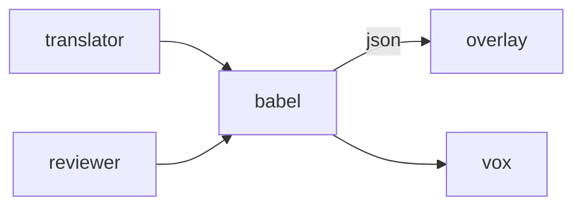

# Babel

**Localization Tool** — Crowdsourcing portal for translating pet dialogue and UI across locales without flattening character.

Part of [ComputerPets](https://github.com/RicheyWorks/computerpets). Map: [computerpets-ecosystem](https://github.com/RicheyWorks/computerpets-ecosystem).

| | |
| --- | --- |
| Status | Design scaffold — contract frozen, implementation next |
| License | MIT |
| First pet | Still [Rui on the desktop](https://github.com/RicheyWorks/computerpets/blob/main/docs/START-HERE.md). This organ is optional. |

## The job

Rui's English is short. Japanese must stay short. Babel ships string kits to Cortex + Companion + desktop, with reviewer gates.

The flagship overlay already puts a living sticker on the real desktop (Rui first, 210 kinds). Babel does not replace that. It is one organ.

## Who uses it

Translators and reviewers. Cortex and Companion consume exports.

## What it is not

Not raw machine translation to prod. Tone lint can hold a string.

## Architecture



## Stack

TypeScript · React 19 · crowdin-style workflow · ICU messages · species-aware tone guides

GroupId / namespace: `com.enterprisepet.babel`  
Default listen: `8080`

## Contract

### Data

`StringKey(id, source, tone) · Suggestion(locale, text, user) · Kit(locale, completePct)`

### Surface

- GET /v1/kits/{locale} — pending strings
- POST /v1/suggest — translator proposal
- POST /v1/approve — reviewer
- GET /v1/export/{locale} — json for clients

### Failure doctrine

Machine-only translation → flagged, not shipped. Missing locale → English fallback. Tone lint fail → stay pending.

## First slice

Build this and stop. Do not boil the ocean.

**en→es kit for overlay care verbs with suggest/approve/export.**

You know it works when: Missing locale: English fallback. Machine-only strings flagged. Short tone stays short.

## Environment

`DATABASE_URL`, `REVIEWER_ROLES`

Never commit secrets. Never put Steam or chain keys in the overlay.

## Neighbors

- computerpets-cortex
- computerpets-vox
- computerpets-companion
- computerpets-lore

## Layout

```
computerpets-babel/
  README.md           this file
  LICENSE             MIT
  docs/CONTRACT.md    the same contract, frozen for implementers
  src/                implementation lands here
```

## Run (Windows)

PowerShell, from this folder, after the flagship helpers (Git, Node LTS 22+, JDK 21 as needed):

```powershell
cd app; npm install; npm run dev
```

You do not need this service to meet Rui. The [flagship start-here](https://github.com/RicheyWorks/computerpets/blob/main/docs/START-HERE.md) is still the first pet.

## Links

- Flagship: [RicheyWorks/computerpets](https://github.com/RicheyWorks/computerpets)
- This repo: [RicheyWorks/computerpets-babel](https://github.com/RicheyWorks/computerpets-babel)
- Map: [RicheyWorks/computerpets-ecosystem](https://github.com/RicheyWorks/computerpets-ecosystem)
- Contract file: [docs/CONTRACT.md](docs/CONTRACT.md)

## License

MIT. See [LICENSE](LICENSE).

---

*Two hundred ten living kinds. Keep them so a line does not go quiet.*
